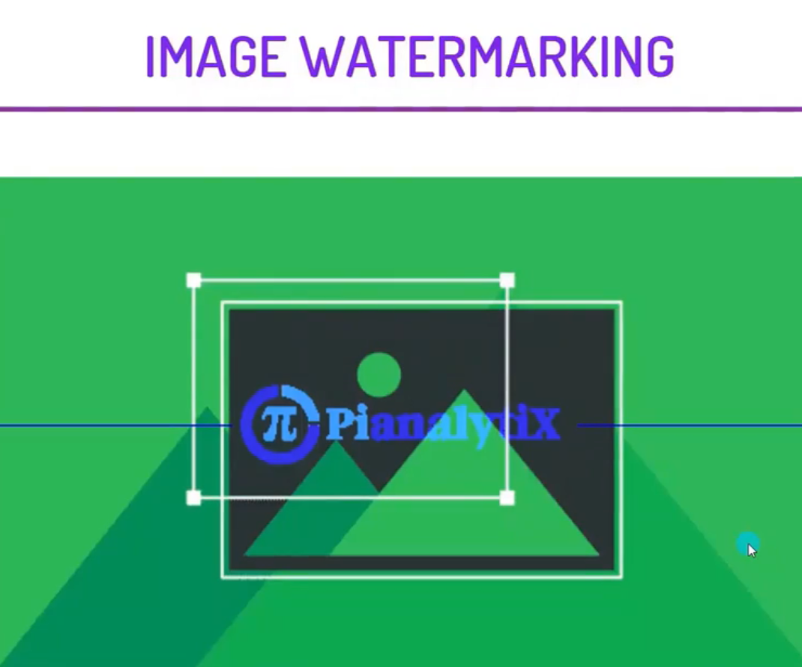

  
 

<h3> https://image-watermarking-flask-app.herokuapp.com/ </h3>
<i>

IN THIS PROJECT. WE WILL SEE HOW WE CAN ADD A WATERMARK TO AN IMAGE. ADDING A WATERMARK WORKS AS COPYRIGHT FOR YOUR IMAGE SO THAT NO ONE CAN ILLEGALLY USE YOUR IMAGE OR DOCUMENT. WE WILL USE OPENCV FOR THIS PROJECT TO ADD LOGOS AND TEXT AS A WATERMARK.

 

  <h2>The Steps to solve the problem </h2>

1. LOADING THE IMAGE AND LOGO FROM URL'S.  
2. RESIZING THE IMAGES.  
3.CONVERT IMAGES INTO RGB FORMAT AND THEN CONVERT IT INTO NUMPY ARRAY.  
4. STORING THE HEIGHT AND WIDTH OF THE IMAGE AND LOGO.  
5. FINDING OUT THE COORDINATES OF THE CENTER OF THE IMAGE.  
6. FINDING OUT THE REGION OF INTEREST TO DRAW LOGO.  
7. MERGING THE LOGO WITH THE IMAGE AND VISUALIZING IT.  
8. CREATING THE TEXT WATERMARK  
9. USING CV2 FUNCTION TO DEFINE TEXT PROPERTIES AND APPLYING IT AT SPECIFIC COORDINATES.  
10. CONVERTING THE IMAGE INTO RGB AND VISUALIZING IT.  

<i>
Adding a watermark to an image works as copyright. Different organizations can use it to make their content secure so that their content cannot be misused without their license or a paid version. In this project, we saw how easily we can use OpenCV to add watermarks to our images. 

     
  
  <h1> Screenshots </h1>
  <h2> Input Screen </h2>
 
  
    
  
<h2> Output Screen </h2> 

   
    
    

 
### Give It a Star if you liked the project 
 </i>

